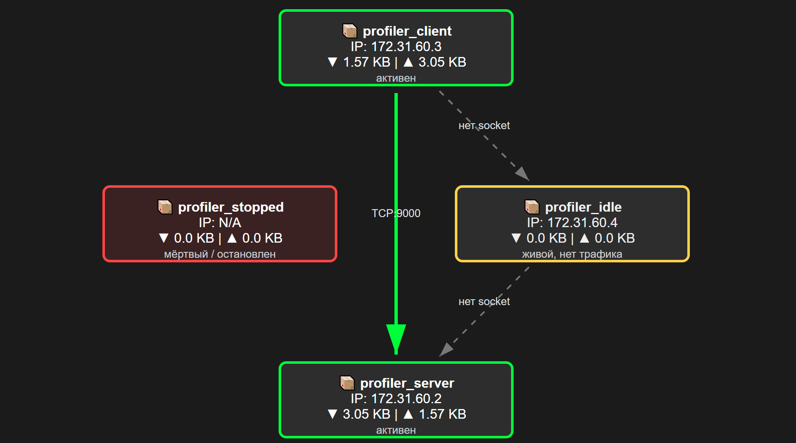
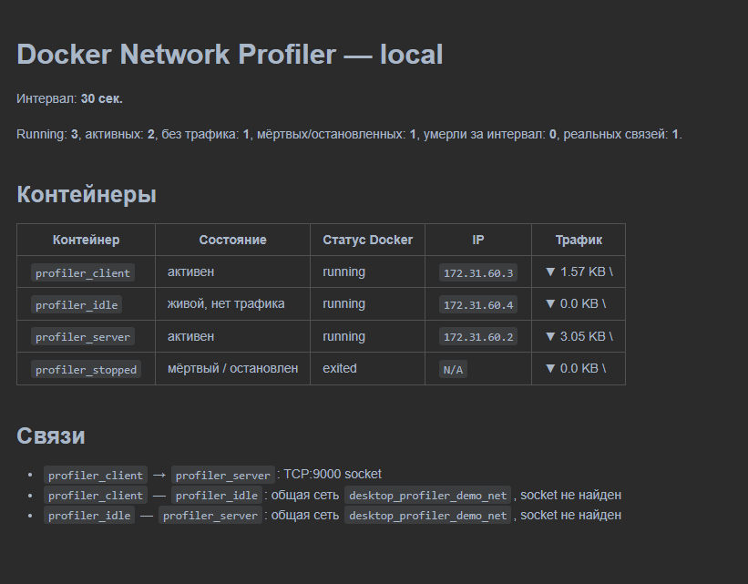
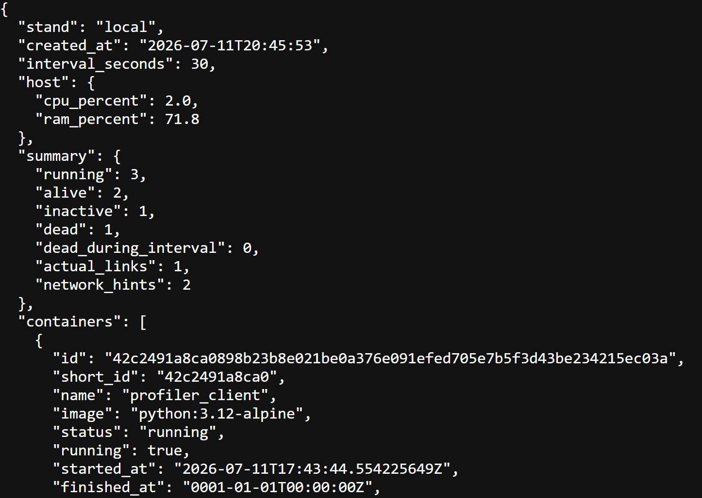

# Docker Network Profiler

Docker Network Profiler анализирует состояние Docker-контейнеров на локальном компьютере. Он собирает информацию о запущенных и остановленных контейнерах, их IP-адресах и сетях. Во время заданного интервала утилита отслеживает входящий и исходящий трафик, а также реальные сетевые соединения между контейнерами. После этого программа определяет активные, неактивные и завершившиеся контейнеры. Результаты сохраняются в виде отчётов в форматах HTML, Markdown и JSON.

## Состояния контейнеров

| Состояние | Условие | Отображение в HTML |
|---|---|---|
| `alive` | Контейнер работает и имеет трафик либо найденную socket-связь | зелёная рамка |
| `inactive` | Контейнер работает, но трафик и связи не обнаружены | жёлтая рамка |
| `dead` | Контейнер завершён, остановлен, удалён или умер за интервал | красная рамка |
| `stopped` | Контейнер не работает, но не попал в отдельную категорию `dead` | красная рамка |

Порог шума по умолчанию — `1 KB` суммарного трафика за интервал.

## Отчёты

### HTML

HTML-отчёт содержит:

- визуальный граф контейнеров;
- направление соединений;
- протокол и порт назначения;
- IP-адрес и трафик каждого контейнера;
- цветовую индикацию состояния;
- сводку по контейнерам и связям;
- загрузку CPU и RAM хоста.

#### Цвета на графе

- зелёная рамка — контейнер running и за интервал есть трафик или socket-связь.
- жёлтая рамка — контейнер running, но за интервал активности не видно.
- красная рамка — контейнер exited/dead/removed.
- зелёная стрелка — найден реальный socket контейнер → контейнер.
- серая стрелка — контейнеры в одной Docker-сети, но socket-связь не найдена. Направление стрелки условное и определяется порядком контейнеров в списке.



### Markdown

Markdown-отчёт подходит для GitHub, GitLab, Wiki и документации. Он содержит краткую сводку, таблицу контейнеров и список найденных связей.



### JSON

JSON-отчёт предназначен для автоматической обработки, интеграции с другими инструментами и последующего анализа.



## Запуск в PyCharm на Windows

1. Установить и запустить Docker Desktop.
2. Открыть папку с этим проектом в PyCharm.
3. В терминале PyCharm выполнить установку зависимостей:

```bash
pip install -r requirements.txt
```

4. Для проверки без Docker можно использовать демо-режим. Демо-режим создаёт тестовый стенд из четырёх контейнеров:

```bash
python main.py --demo --out reports/demo
```

Результат 3 отчета:

```text
reports/demo.html
reports/demo.md
reports/demo.json
```

5. Для запуска на своих Docker-контейнерах:

```
python main.py --time 30 --sample-interval 1 --stand local --out reports/report
```

Результат 3 отчета:

```text
reports/report.html
reports/report.md
reports/report.json
```
